# 0xGame 2024 Week 1 Writeup

## hicancan’s 0xGame Writeup

### Misc

#### 0xGame2048

1. “通过一点也不可靠的途径，我们提前截获了0xGame2048的题目，据说这就是那时候的base编码?”
2. 给了一个0xGame2048.txt文件，里面是一串乱码  
`Жఱ൲ඌיય೬ࢶЖۍךะtঋළม۹ρԊҽඹ`
3. 进过多个不同的base编码尝试后，猜测该字符串是由base2048编码的
4. 搜索找到一个在线base2048解码工具  
<https://nerdmosis.com/tools/encode-and-decode-base2048>
5. 利用该在线解码工具解码后得到flag  
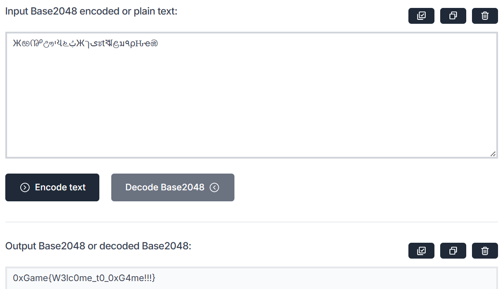
6. flag：`0xGame{W3lc0me_t0_0xG4me!!!}`

#### 关注DK盾谢谢喵

1. “关注微信公众号, 发送 0xGame 2024 以获取 flag”  

2. 打开微信扫描二维码，关注后发送"0xGame 2024"，得到flag  
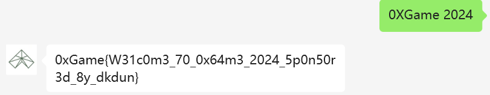
3. flag：`0xGame{W31c0m3_70_0x64m3_2024_5p0n50r3d_8y_dkdun}`

#### 我的世界基岩版(?

1. 服务器：mc.st4rr.top:25526  
版本：java 1.21 Fabric  
“题目很简单，只是为了开个服务器给大家玩玩 😃  
如果服务器崩了或者有问题欢迎到群里拷打出题人 😦  
世界中铁轨为玩家所建，另外告示牌皆为玩家所编辑，切勿随意相信:(”
2. 此地无银三百两，那必须找找告示牌哇，注意ve后_的为英语中的换行连字符  
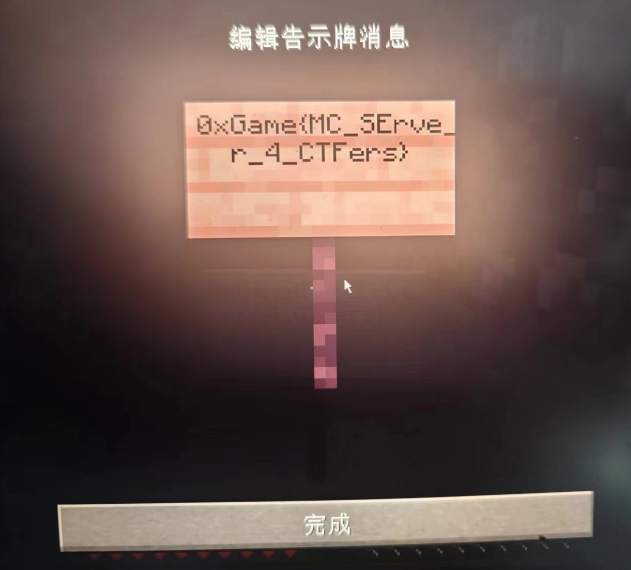
3. flag:`0xGame{MC_SErver_4_CTFers}`

### Crypto

#### Caesar Cipher

1. 密文：`0yHbnf{Uif_Cfhjoojoh_Pg_Dszqup}`  
提示：凯撒加密。
2. 搜索到凯撒加密解密在线工具：<https://ctf.bugku.com/tool/caesar>
3. 由于不知道偏移量所以需要枚举偏移量，偏移量为1-25  
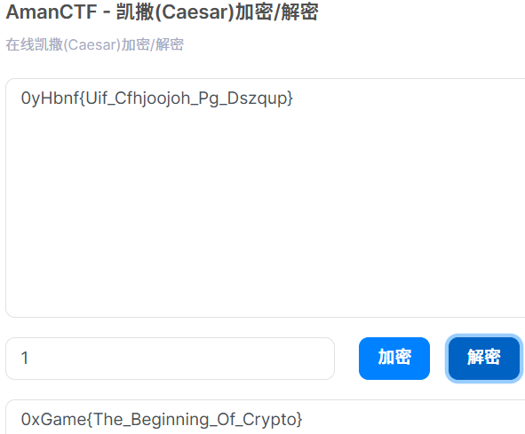  
逐个尝试得到25个解密后的字符串，发现偏移量为1时解密后的字符串有意义
4. flag:`0xGame{The_Beginning_Of_Crypto}`

#### Code

1. 给了一段代码，尝试理解并补充注释如下

```python
# 导入bytes_to_long函数，用于将字节串转换为长整数
from Crypto.Util.number import bytes_to_long
# 导入base64编码函数
from base64 import b64encode
# 导入secret模块中的flag变量，这个变量应该是一个字符串，代表要处理的信息
from secret import flag
# 将flag字符串编码为字节串
msg = flag.encode()
# 获取编码后的字节串长度
length = len(msg)
# 确保字节串的长度可以被4整除，这样才能均匀地分成四个部分
assert length%4 == 0
# 计算每个部分的长度
block = length//4
# 将字节串分成四个部分，每部分长度为block
m = [ msg[ block*(i) : block*(i+1) ] for i in range(4) ]
# 第一部分直接赋值给m0
m0 = m[0]
# 第二部分使用bytes_to_long转换为长整数，赋值给m1
m1 = bytes_to_long(m[1])
# 第三部分转换为十六进制字符串，赋值给m2
m2 = m[2].hex()
# 第四部分使用base64编码，赋值给m3
m3 = b64encode(m[3])
# 打印出每个部分的值
print(f'm0 = {m0}\nm1 = {m1}\nm2 = {m2}\nm3 = {m3}')
```

1. 分析：为了找出flag，我们需要对每个部分进行逆向操作。
    1. m0是原始的字节串的一部分。
    2. m1是一个长整数，我们需要将其转换回字节串。
    3. m2是一个十六进制字符串，我们需要将其转换回字节串。
    4. m3是一个base64编码的字符串，我们需要对其进行解码。
2. 写出逆向解码代码

```python
from Crypto.Util.number import long_to_bytes
from base64 import b64decode
# 根据注释中的示例输出，我们有：
m0 = b'0xGame{73d7'
m1 = 60928972245886112747629873
m2 = '3165662d393339332d3034'
m3 = b'N2YwZTdjNGRlMX0='
# 将m1转换回字节串
m1_bytes = long_to_bytes(m1)
# 将m2的十六进制字符串转换回字节串
m2_bytes = bytes.fromhex(m2)
# 将m3的base64编码解码回字节串
m3_bytes = b64decode(m3)
# 将所有部分合并回原始的flag字符串
flag_bytes = m0 + m1_bytes + m2_bytes + m3_bytes
# 将字节串解码为字符串
flag = flag_bytes.decode()
print(flag)
```

1. 运行结果

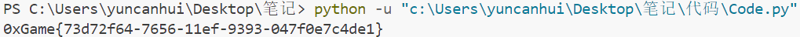  
编译运行得到flag：

`0xGame{73d72f64-7656-11ef-9393-047f0e7c4de1}`

#### Code-Vigenere

1. 给了一段代码，尝试理解并补充注释如下

```python
# 从secret模块导入flag变量
from secret import flag
# 从os模块导入urandom函数，用于生成随机字节串
from os import urandom
# 从base64模块导入b64encode函数，用于对字节串进行base64编码
from base64 import b64encode
# 定义Encrypt函数，参数为消息msg和密钥key
def Encrypt(msg, key):
    # 获取密钥的长度
    Lenth = len(key)
    # 初始化结果字符串
    result = ''
    # 定义大写字母和小写字母的起始ASCII值
    upper_base = ord('A')
    lower_base = ord('a')
    # 将密钥转换为大写，并将每个字符转换为其对应的ASCII值减去'A'的ASCII值
    KEY = [ord(key.upper()[_]) - upper_base for _ in range(Lenth)]
    # 初始化索引
    index = 0
    # 遍历消息中的每个字符
    for m in msg:
        # 获取当前密钥字符对应的ASCII值
        tmp_key = KEY[index % Lenth] 
        # 如果当前字符不是字母，则直接添加到结果字符串
        if not m.isalpha():
            result += m
            continue
        # 如果当前字符是大写字母，进行加密
        if m.isupper(): 
            result += chr(upper_base + (ord(m) - upper_base + tmp_key) % 26)
        # 如果当前字符是小写字母，进行加密
        else: 
            result += chr(lower_base + (ord(m) - lower_base + tmp_key) % 26)
        # 索引增加
        index += 1
    # 返回加密后的结果字符串
    return result
# 生成随机密钥，长度为6字节，然后进行base64编码，取前5个字符作为密钥
key = b64encode(urandom(6))[:5].decode()
# 使用生成的密钥加密flag，并打印加密后的结果
print(Encrypt(flag,key))
# 注释中的字符串是加密后的flag为：
# 0lCcop{oyd94092-g8mq-4963-88b6-4helrxdhm6q7}
```

1. 分析：为了找出flag，首先我们需要5个字符的密钥，然后使用这个密钥对加密后的字符串进行解密。  
由于我们确定题解的格式是0XGame{}，所以我们可以通过前五个字母的明文与密文的对应关系来推断出密钥。下面通过编程实现密钥的推断：

```python
def calculate_key(pt, ct):
    """
    根据给定的明文和密文,计算Vigenère密码的密钥。
    参数:
    pt (str): 明文字符串。
    ct (str): 密文字符串。
    返回:
    str: 计算出的密钥字符串。
    """
    key = []  # 初始化密钥列表，用于存储每个字符的密钥偏移量
    upper_base = ord('A')  # 大写字母的ASCII起始值
    lower_base = ord('a')  # 小写字母的ASCII起始值
    # 遍历明文和密文的每个字符
    for p, c in zip(pt, ct):
        if not p.isalpha():  # 跳过非字母字符
            continue
        if p.isupper():  # 如果字符是大写字母
            p_val = ord(p) - upper_base  # 将字符转换为0-25的数值
            c_val = ord(c) - upper_base  # 同上
        else:  # 如果字符是小写字母
            p_val = ord(p) - lower_base
            c_val = ord(c) - lower_base
        # 计算密钥偏移量，使用模26确保结果在0-25之间
        key_offset = (c_val - p_val) % 26
        # 将偏移量转换回大写字母，并添加到密钥列表中
        key.append(chr(upper_base + key_offset))
    # 将密钥列表连接成字符串并返回
    return ''.join(key)
# 给定的明文和密文
plaintext = '0xGame'
ciphertext = '0lCcop'
# 移除明文中的非字母字符
plaintext = ''.join(filter(str.isalpha, plaintext))
ciphertext = ''.join(filter(str.isalpha, ciphertext))
# 确保明文和密文长度相同
assert len(plaintext) == len(ciphertext)
# 计算密钥
key = calculate_key(plaintext, ciphertext)
print("key =", key)
```

编译运行结果如下：  
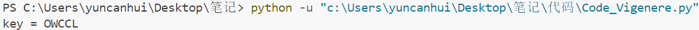  
key = OWCCL  
3. 使用密钥解密加密后的字符串：  
搜索得到Vigenere加密解密在线工具：<https://ctf.bugku.com/tool/vigenere>  
利用key = OWCCL进行解密，得到flag：  
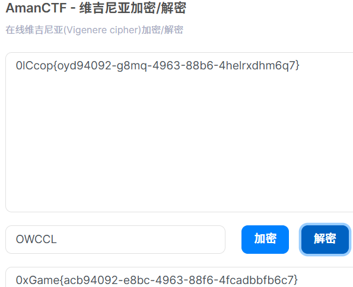  
4. 得到flag:

`0xGame{acb94092-e8bc-4963-88f6-4fcadbbfb6c7}`

#### RSA-Baby

1. 给了一段代码，尝试理解并补充注释如下

```python
from Crypto.Util.number import bytes_to_long, getPrime  # 导入Crypto.Util.number模块中的bytes_to_long和getPrime函数
from hashlib import md5  # 导入哈希库中的md5函数，用于生成哈希值
from random import randint  # 导入随机数生成函数，用于生成随机数
from gmpy2 import invert, gcd  # 导入gmpy2库中的invert和gcd函数，用于计算模逆和最大公约数
# 定义MD5哈希函数，用于生成输入m的MD5哈希值
def MD5(m):
    return md5(str(m).encode()).hexdigest()
# 定义RSA密钥生成函数，用于生成公钥和私钥
def KeyGen():
    Factor_BitLength = 30  # 定义素数因子的位数，这里设置为30位
    q = getPrime(Factor_BitLength)  # 生成一个30位的素数q
    p = getPrime(Factor_BitLength)  # 生成一个30位的素数p
    N = p * q  # 计算N，即公钥和私钥的模数，N=p*q
    # 计算欧拉函数值phi(N)，用于生成公钥和私钥
    phi = (p-1) * (q-1)
    # 生成公钥和私钥
    while True:
        e = randint(1, phi)  # 在1到phi之间随机选择一个整数e
        if gcd(e, phi) == 1:  # 如果e和phi互质，则e可以作为公钥的一部分
            d = int(invert(e, phi))  # 计算d，即私钥的一部分，d是e模phi的逆元
            break
    # 生成公钥和私钥，并返回
    Pub_Key = (N, e)  # 公钥由模数N和加密指数e组成
    Prv_Key = (N, d)  # 私钥由模数N和解密指数d组成
    return Pub_Key, Prv_Key
# 调用KeyGen函数生成公钥和私钥
Pub, Prv = KeyGen()
# 提取公钥和私钥的参数
N = Pub[0]  # 提取公钥的模数N
e = Pub[1]  # 提取公钥的加密指数e
d = Prv[1]  # 提取私钥的解密指数d
# RSA加密过程，生成随机消息m并加密
m = randint(1, N)  # 在1到N之间随机生成一个整数m作为消息
c = pow(m, e, N)  # 使用公钥(N, e)加密消息m，得到密文c
# 打印公钥、私钥和加密后的消息
print(f'Pub_Key = {Pub}')
print(f'Prv_Key = {Prv}')
print(f'Encrypt_msg = {c}')
# 假设已知加密消息c的值，这里给出示例值
'''
Pub_Key = (547938466798424179, 80644065229241095)
Prv_Key = (547938466798424179, 488474228706714247)
Encrypt_msg = 344136655393256706
'''
# 使用MD5函数计算原始消息m的MD5哈希值，并构造flag
flag = '0xGame{' + MD5(m) + '}'
```

1. 分析：我们可以首先使用RSA解密公式$m = c^dmodN$  
来解密密文 c，得到原始消息 m。然后，我们计算 m 的MD5哈希值，并将其拼接到固定的字符串 ‘0xGame{’ 后面，形成最终的flag，实现代码如下：

```python
from Crypto.Util.number import long_to_bytes
from hashlib import md5
# 已知的值
N = 547938466798424179
d = 488474228706714247
c = 344136655393256706
# RSA 解密
m = pow(c, d, N)
# 计算m的MD5哈希值
def MD5(m):
    return md5(str(m).encode()).hexdigest()
m_hash = MD5(m)
# 构造flag
flag = '0xGame{' + m_hash + '}'
print(flag)
```

编译运行结果如下：  
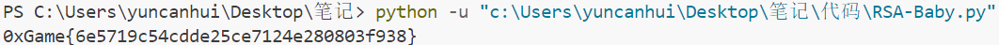  
3. 得到flag：  
`0xGame{6e5719c54cdde25ce7124e280803f938}`

### Pwn

#### test your nc

1. “Prepare your netcat. Connect to server then you will get your first flag. nc 47.97.58.52 40000”由题目下载好netcat

2. cmd运行nercat连接到服务器的结果：  
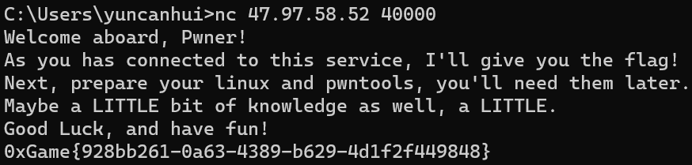

3. 得到flag：

`0xGame{928bb261-0a63-4389-b629-4d1f2f449848}`

### Web

#### ez_login

1. 题目给出一个网站<http://47.76.151.192:60084>  
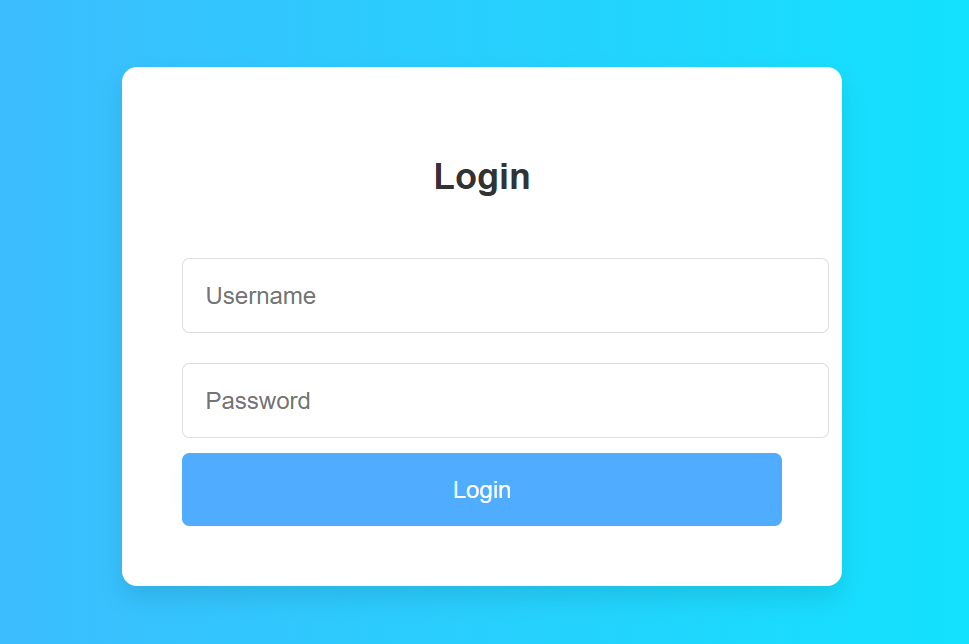

2. 分析：有两个输入框，尝试使用burpsuite的intruder进行弱口令爆破密码：

3. 首先用burpsuite内嵌浏览器访问网站，然后任意填写username和password点击login，抓包拦截：  
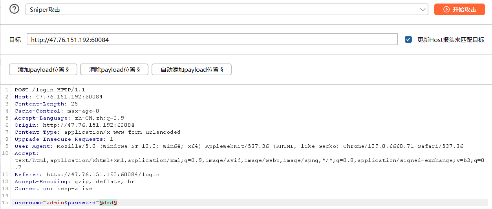  
不妨猜测用户名为admin，添加payload位置到password，然后点击attack进行爆破：  
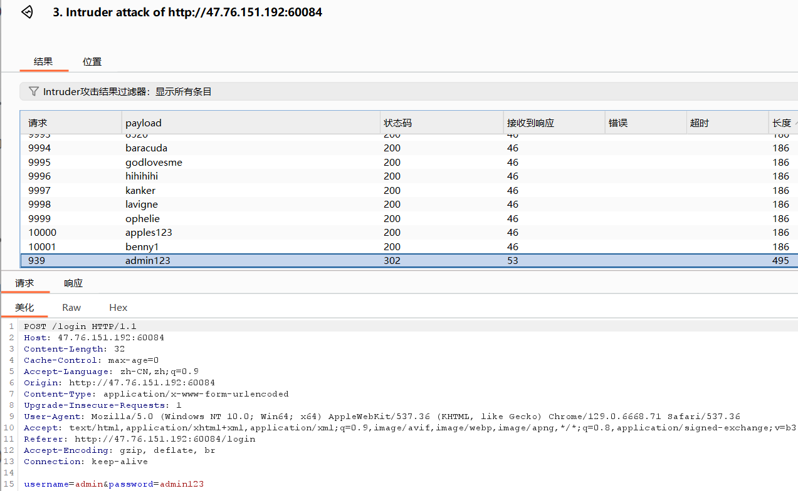  
爆破得到密码为admin123

4. 利用得到的用户名和密码登录网站，得到flag：  
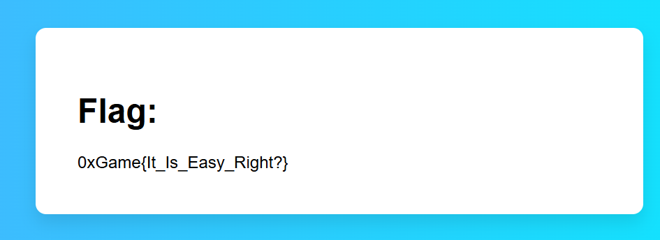

5. flag:

`0xGame{It_Is_Easy_Right?}`

#### hello_http

1. 题目给出一个网站[http://8.130.84.100:50002/：](http://8.130.84.100:50002/%EF%BC%9A)  
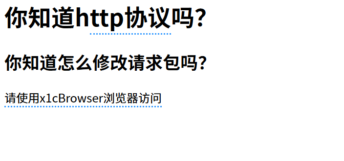
2. 分析：尝试通过修改请求包伪装成xlcBrowser浏览器:python爬虫代码如下：

```python
import requests
# 目标URL
url = 'http://8.130.84.100:50002/'
# 伪装成x1cBrowser的headers
headers = {
    'User-Agent': 'x1cBrowser',
}
# 发送POST请求
response = requests.post(url, headers=headers)
# 打印响应内容
print(response.text)
```

1. 运行结果如下：  
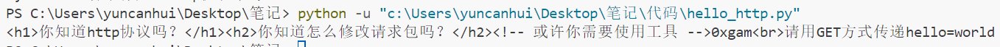  
于是用get方式传递hello=world
2. 此次类推，每一步修改都按照运行的结果进行：得到最终的代码：

```python
import requests
# 目标URL
url = 'http://8.130.84.100:50002/'
# 伪装成x1cBrowser的headers
headers = {
    'User-Agent': 'x1cBrowser',
    'Referer': 'http://localhost:8080/',
    'X-Forwarded-For': '127.0.0.1'
}
# GET请求的参数
params = {
    'hello': 'world'
}
# POST请求的参数
data = {
    'web': 'security'
}
# 设置cookie
cookies = {
    'flag': 'secret'
}
# 发送POST请求
response = requests.post(url, headers=headers, data=data,params=params, cookies=cookies)
# 打印响应内容
print(response.text)
```

1. 运行结果如下：  
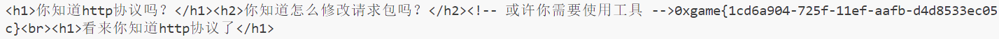

2. 得到flag：

`0xgame{1cd6a904-725f-11ef-aafb-d4d8533ec05c}`

#### hello_web

1. 题目给出一个网站Flag  
<http://8.130.84.100:50001/>  
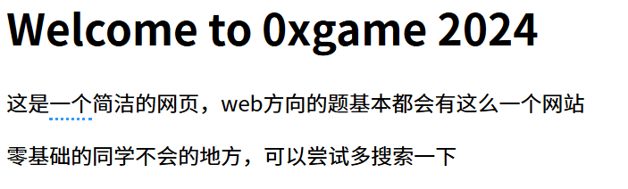
2. 首先考虑查看源代码，发现右键后不行确定解题方向：  
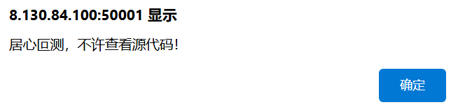
3. 尝试F12也不行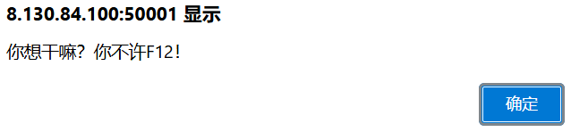
4. 尝试Ctrl+U查看源代码：  
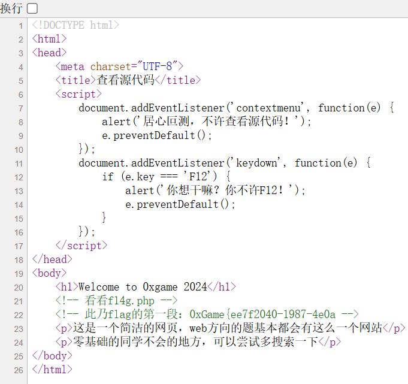
5. 源代码中得到flag前半段：`0xGame{ee7f2040-1987-4e0a`  
提示查看：“看看f14g.php”
6. 所以考虑利用wireshark抓包查看请求包：  
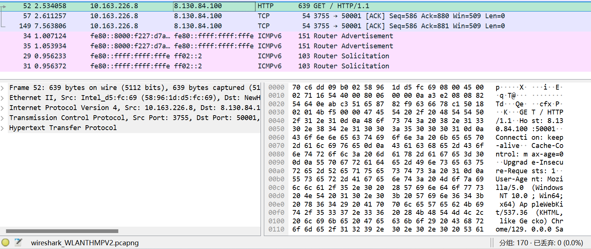  
找到flag后半段：`-872d-68589c4ab3d3}`
7. 合并得到flag：`0xGame{ee7f2040-1987-4e0a-872d-68589c4ab3d3}`

### Reverse

#### BabyBase

1. 题目给了一个BabyBase.exe文件，用Vscode中16进制编辑器查看：  
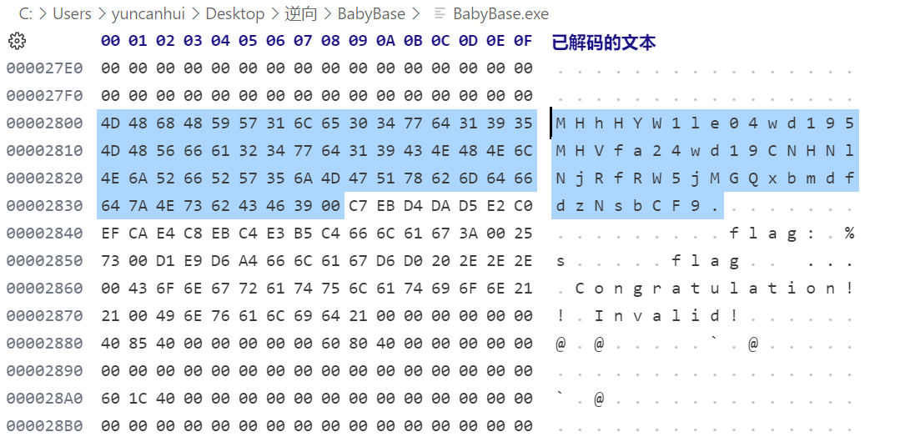
2. 找到flag附近的可疑的连续可解码的base64编码的字符片段：  
`MHhHYW1le04wd195MHVfa24wd19CNHNlNjRfRW5jMGQxbmdfdzNsbCF9`
3. 用base64在线解码工具进行解码：  
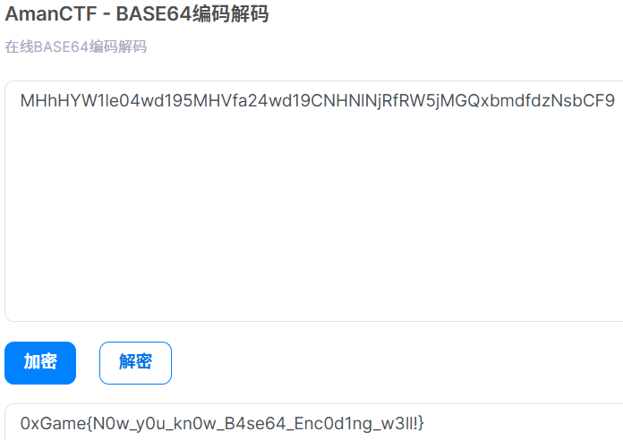
4. 得到flag：  
`0xGame{N0w_y0u_kn0w_B4se64_Enc0d1ng_w3ll!}`

#### BinaryMaster

1. 题目给了一个BinaryMaster.exe文件，用Vscode中16进制编辑器查看：找到flag：  
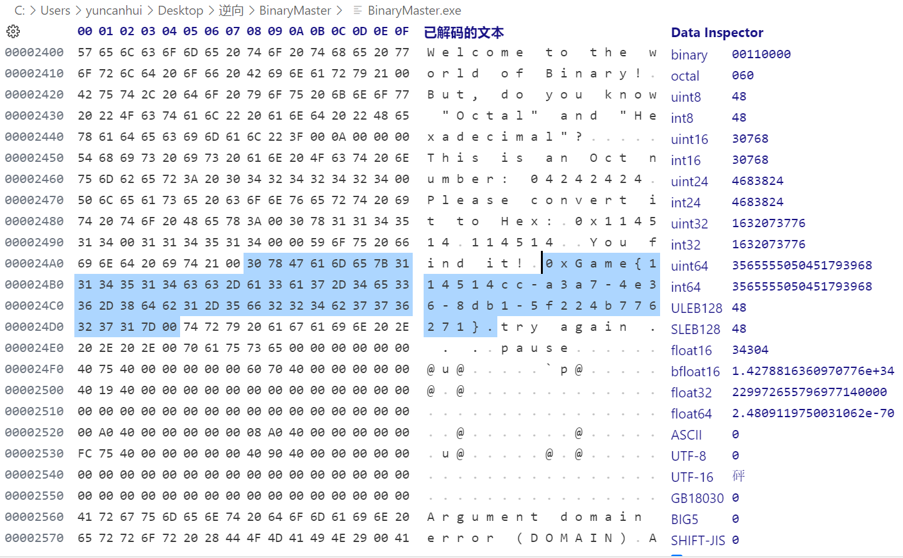
2. flag：

`0xGame{114514cc-a3a7-4e36-8db1-5f224b776271}`

#### SignSign

1. 题目给了一个Signin.exe文件，用Vscode中16进制编辑器查看：找到有关flag的片段：  
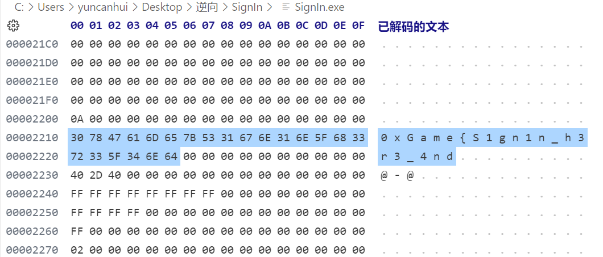  
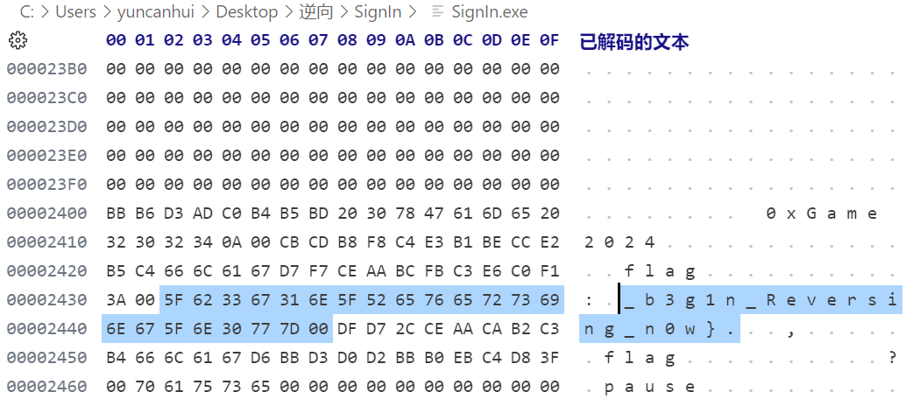
2. flag被分在了两个片段，将他们合并得到flag：  
`0xGame{S1gn1n_h3r3_4nd_b3g1n_Reversing_n0w}`

### Blockchain

#### 肘，上链

1. 题目给了服务器端口、rcp、水龙头地址：  
nc 156.238.233.7 20000  
rpc <http://156.238.233.7:8545>  
faucet 156.238.233.7:8080
2. 在metamask中连接到网络，创建一个账户，然后使用水龙头地址输入自己的地址获取一些以太币：  
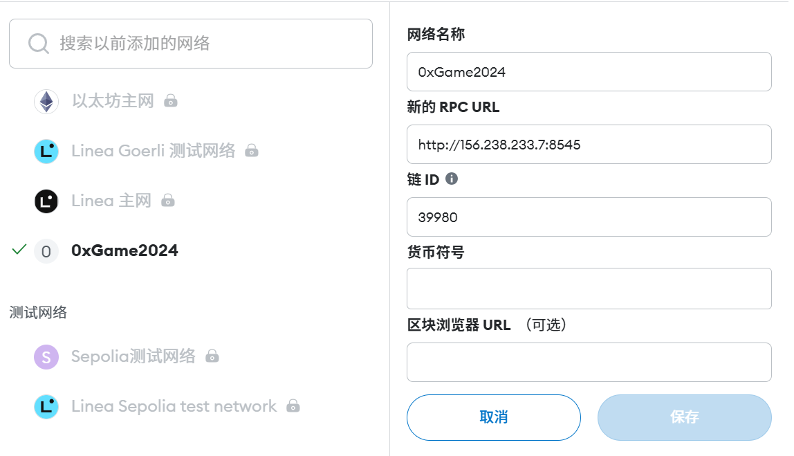  
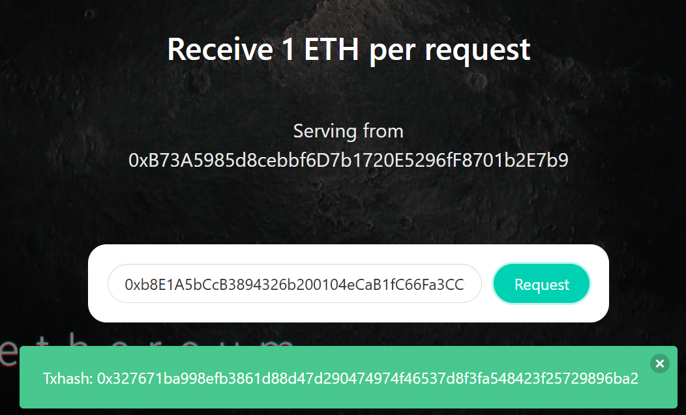
3. 用netcat连接到服务器：  
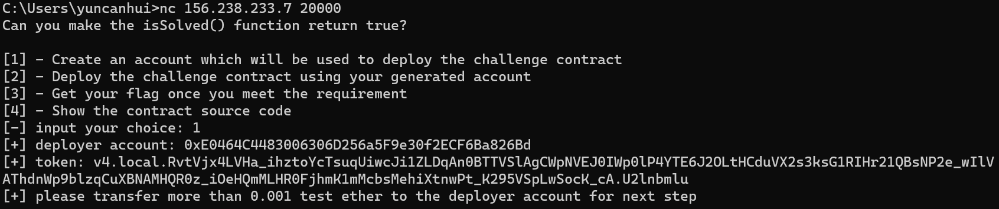  
按照要求给地址转账0.01个以太币：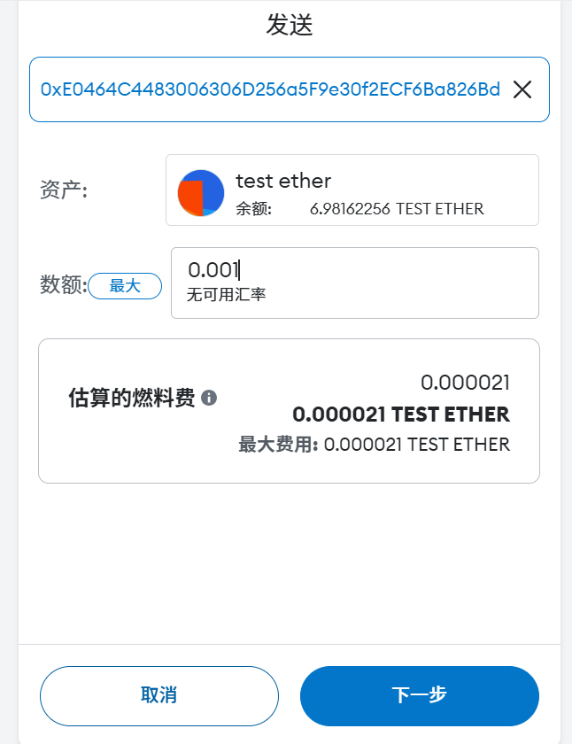  
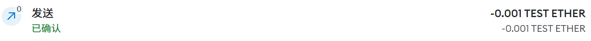
4. 转账确认成功后，再次连接服务器进入第2步：  
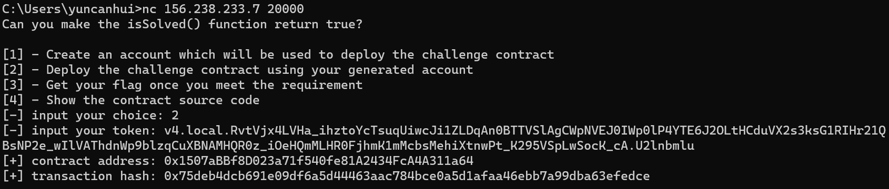
5. 要部署合约使得函数issolved()返回true，所以需要找到合约代码：再次连接服务器进入第4步查看合约代码：  
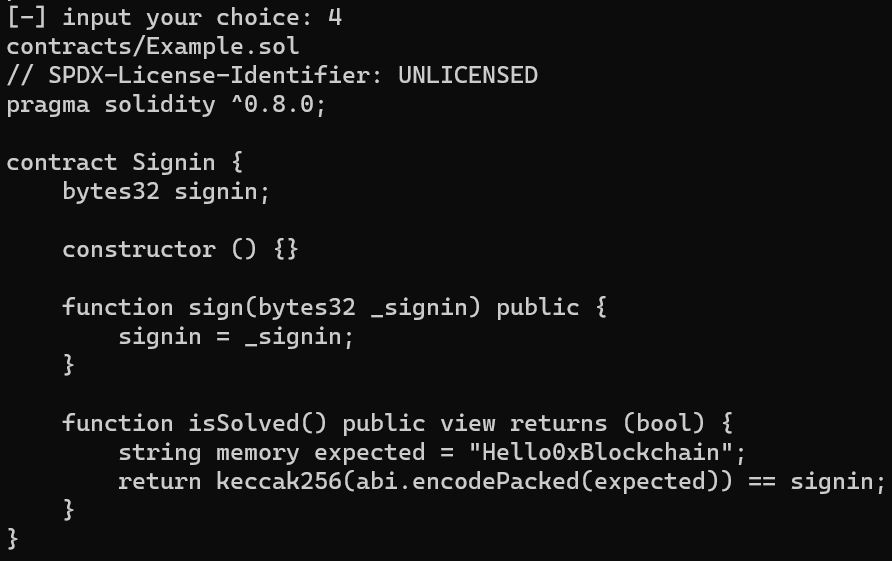
6. 用RemixIDE相应的版本编译合约代码：  
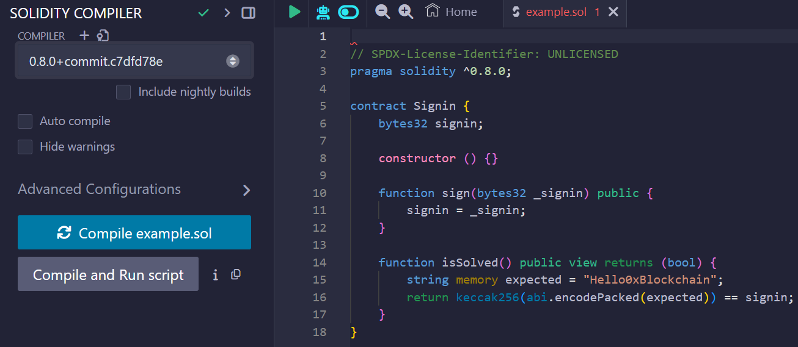
7. 输入合约地址：查看到两个函数  
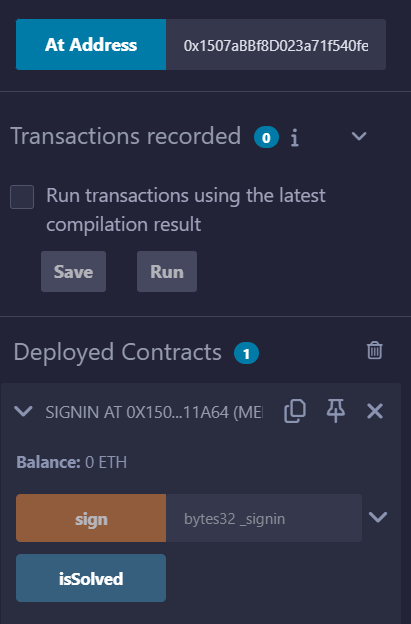
8. 按照合约代码要求在sign函数右侧输入“Hello0xBlockchain”的256hash值，才能使issolved函数返回true，因此计算出hash值输入：  
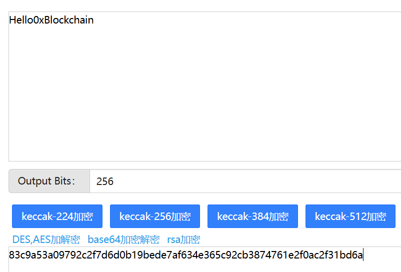  
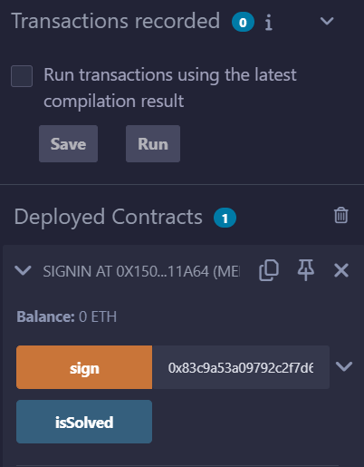
9. 选择metamask账户，并点击sign提交哈希值，完成交易后，然后点击issolved查看返回值已经为true：  
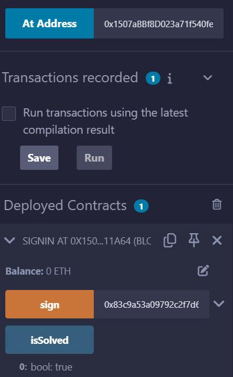
10. 然后再次连接服务器，进入第三步输入token得到flag：  
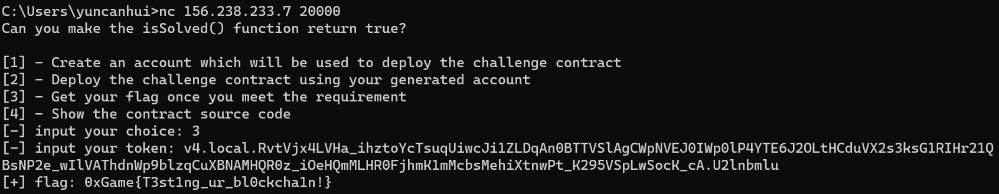
11. flag：  
`0xGame{T3st1ng_ur_bl0ckcha1n!}`
