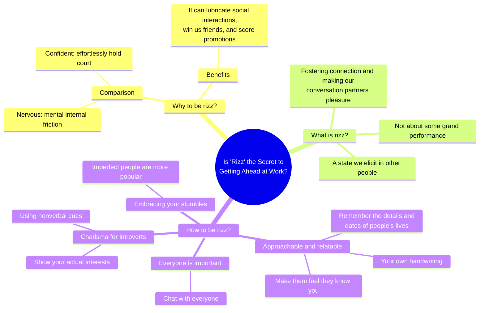

# **Is ‘Rizz’ the Secret to Getting Ahead at Work?**

——“魅力”是在职场脱颖而出的秘诀吗?

hicancan的英语阅读笔记

* * *

* * *

## Background Supplement【背景补充】

>   
> 2023牛津词典年度热词**Rizz**  
>  英国牛津大学出版社12月4日公布，年轻人常用的网络俚语“Rizz”顺利脱颖而出，成为2023的牛津年度词汇。根据牛津大学出版社，“Rizz”含意为有魅力、具有吸引力及可以吸引浪漫及性伴侣。「Rizz」被视为“非凡的个人魅力”（charisma）一词的缩短版本。  
> 例句：  
> 「Dan might not be conventionally attractive,but he possesses some serious rizz—just look at how he’s charming those two models.」  
> 「丹可能没有传统意义上的吸引力，但他拥有一些严肃的魅力——看看他是如何吸引那两个模特的。」  
> 它也可以用作动词，用在“to rizz up”等俗语中，意思是吸引、引诱或与某人聊天。但是这个词是网络俚语，主要由年轻人在网络上使用。在TikTok上标签“rizz”的浏览量达到数十亿次。YouTube博主兼Twitch主播Kai Cenat被广泛认为是这词的普及者。今年这个词的使用量继续攀升，六月份，Buzzfeed向演员Tom Holland询问了他的rizz秘密。Tom Holland回答说：“我没有任何rizz，我的rizz有限。”然后解释说，他通过“持久战”赢得了女友Zendaya的芳心。  
>   
>   
> 这个采访后，“rizz”的使用更加频繁。牛津语言学院院长卡斯珀·格拉思沃尔(Casper Grathwohl)表示，这个词可能代表了“2023年的普遍情绪，即我们中的更多人在经历了充满挑战的几年后开始敞开心扉，对自己充满信心”。

> cha·ris·ma n. /kəˈrɪzmə/  
> The President has great personal charisma.总统具有超凡的个人魅力。
> 
> **Clipping截短法构词：cha·ris·ma$\rightarrow$ris$\rightarrow$rizz**

* * *

* * *

## Whether you call it charisma, charm or magnetism【磁性；吸引力】, some people seem like naturals. 【whether强调内涵】


By Rachel Feintzeig

Mon, Jul 22, 2024 11:35am 4 min


## Good news: It can be learned

Great leaders have it. Gen Z has a new word for it【指rizz】. Can **the rest of us** 【文章对象：泛指ordinary people】 learn it?

**【与副标题："Good news: It can be learned.“问答对应，引出文章核心如何习得"rizz”】**

* * *

**Generation**| **Time Frame**| **Age Now**  
---|---|---  
The Silent Generation| 1928-1945| 79-96 years old  
Baby Boomers| 1946-1964| 60-78 years old  
Gen X| 1965-1980| 44-59 years old  
Millennials【千禧一代】| 1981-1996| 28-43 years old  
Gen Z【Z世代；后浪】| 1997-2012| 12-27 years old  
Gen Alpha| Early 2010s-2025| 0-approx. 11 years old  
  
* * *

Charisma—or rizz , as current teenage slang【俚语】 has anointed【抹油使神圣化“镀金”】 it—can feel like an ephemeral【short-lived】 gift some【如"Great leaders"】 are just born with. The chosen【“天选之子”】 among us network and chitchat, exuding【exude散发】 warmth as they effortlessly hold court【成为众人瞩目的焦点】. **Then** there’s everyone else, agonising over【纠结于……】 exclamation points【！】 in email drafts and internally【in mind】 replaying that joke they made in the meeting, wondering if it hit【successful】.

**【泛象对比：rizz人以及非rizz：前者自信，后者精神内耗、overthinking、of mental internal friction（摩擦f）】**

“Well, this is awkward,” Mike **Rizzo** 【正好包含rizz哈哈哈】, the head of a community for marketing operations professionals, says of rizz being crowned 2023 word of the year by the publisher of the Oxford English Dictionary. It’s so close to his last name, but so far from how he sees himself. He sometimes gets sweaty palms【手心出汗】 before hosting webinars【在线研讨会】.

**【具象对比：以Rizzo这个具体的人为例，指出非rizz人的awkward and nervous】**

* * *

Who could blame us for obsessing over【对……思虑过度】 charisma, or lack thereof ? It can lubricate【promote】 social interactions, win us friends, and score promotions【获得晋升】. It’s also possible to cultivate【train】, assures【ensure】 Charles Duhigg, the author of a book about people he dubs【call】super communicators.

**【引出书，说明rizz的可培养性】**

At its heart, charisma isn’t about some grand performance. It’s a state we elicit【引出，得到】 in other people, Duhigg says. It’s about fostering【培养】 connection and making our conversation partners feel they’re the charming—or interesting or funny—ones.

**【指出rizz的本质：不在于表演而在于connection！】**

The key is to ask deeper, though not prying【窥探的】, questions that invite meaningful and revealing responses, Duhigg says. And **match the other person’s vibes**【共鸣】. Maybe they want to talk about emotions, the joy they felt watching their kid graduate from high school last weekend. 【一种是情感共鸣】Or maybe they’re just after **straight-up** logistics and want you to quickly tell them exactly how the team is going to turn around that presentation by tomorrow.【另一种是理性的分析直接帮助】

**【指出核心方法：match vibes！（其实换句话说能共鸣也可以说是有情商）】**

You might be hired into a company for your skill set【整套技能】, Duhigg says, **but** your ability to communicate and earn people’s trust propels【推动】 you up the ladder: “That is **leadership**.”

**【具体方法的职场体现】**

* * *

* * *

## **Approachable and relatable 【平易近人】**

In reporting this column, I was surprised to hear many executives【高管】 and professionals I find breezily confident and pleasantly chatty confess **it wasn’t something that came naturally.** They had to work on it.

**【下面以Dave MacLennan为例子讲述三个work on it的方法】**

Dave MacLennan , who served as chief executive of agricultural giant Cargill for nearly a decade, **started** by leaning into【喜欢】 a nickname: DMac, first bestowed upon him in a C-suite meeting where half the executives were named Dave.

He liked the informality【not formality】 of it. **The further** he ascended【上升】 up the corporate hierarchy【企业层级】, the more he strove【strive努力】 to be approachable and relatable.

Employees “need a reason to follow you,” he says. “One of the reasons they’re going to follow you is that they feel they know you.”

**【方法一： Make them feel they know you】**

* * *

He makes a point to **remember the details and dates of people’s lives** , such as colleagues’ birthdays. After making his acquaintance, in a meeting years ago at The Wall Street Journal’s offices, I was shocked to receive an email from his address months later. Subject line: You , a heading so compelling I still recall it. He went on to say he remembered I was due with my first child any day now and just wanted to say good luck.

“So many people say, ‘Oh, I don’t have a good memory for that,’” he says. Prioritise【给予……优先权】 remembering, making notes on your phone if you need, he says.

**【方法二： Make yourself know them】**

* * *

Now a board member【董事会成员】 and an executive coach, MacLennan sent hundreds of **handwritten notes** during his tenure【任期】. He’d reach out to midlevel managers who’d just gotten a promotion, or engineers who showed him around meat-processing plants. He’d pen words of thanks or congratulations. And he’d address the envelopes himself.

“**Your handwriting is a very personal thing about you** ,” he says. “Think about it. Twenty seconds. It makes such an impact.”

**【方法三： Take advantage of your own handwriting】**

* * *

* * *

## **Everyone’s important**

Doling out your charm selectively will backfire【事与愿违】, says Carla Harris , a Morgan Stanley executive. She chats up the woman cleaning the office, the receptionist at her doctor’s, the guy waiting alongside her for the elevator.

**【也就是Everyone’s important！不要selective！】**

“Don’t be confused,” she tells young bankers. Executive assistants are often the most powerful people in the building, and you **never know** how someone can help—or hurt—you down the line.

**【讲述了why everyone’s important，下面举例子】**

Harris once spent a year mentoring **a junior worker in another department** , not expecting anything in return. One day, Harris randomly mentioned she faced an uphill battle in meeting with a new client. Oh!, the 24-year-old said. **Turns out** , the client was her friend. She made the call right there, setting up Harris for a work win.

**【正所谓“帮助别人就是帮助自己”】**

In the office, stop staring at your phone, Harris advises, and notice the people around you. Ask for their names. Push yourself to start a conversation with three random people every day.

**【提出建议：how：chat with everyone】**

* * *

* * *

## **Charisma for introverts【内向型人格】**

You can’t will yourself to be a bubbly【多泡的哈哈哈形象】 extrovert【外向型人格】, **but you can find your own brand of charisma** , says Vanessa Van Edwards, a communications trainer and author of a book about charismatic communication.

**【方法一：Using nonverbal cues】**

For introverted clients, she recommends **using nonverbal cues**【非语言暗示】. A slow triple【三】 nod shows people you’re listening. Placing your hands in the steeple position, together and facing up, denotes【indicate】 that you’re calm and present.

**【方法二：Show your actual interests】**

**Try coming up with one question you’re known for.** Not a canned【罐头装的=老套的】, hokey【做作的】 ice-breaker, but something casual and simple that reflects your **actual interests**. One of her clients, a bookish executive struggling with uncomfortable, halting starts to his meetings, began kicking things off by asking “Reading anything good?”

* * *

* * *

## **Embracing your stumbles【接纳错误】**

Charisma starts with confidence. It’s not that captivating【rizz/charm/appealing/of charisma】 people don’t occasionally mispronounce a word or spill【洒】 their coffee, says Henna Pryor, who wrote a book about embracing awkwardness at work. They just have a faster comeback rate **than** the rest of us. They call out the stumble **instead of** trying to hide it, make a small joke, and move on.

Being perfectly polished all the time is **not only** exhausting【主观原因】, it’s impossible【客观原因】. We know this, which is why appearing flawless【完美无瑕】 can come off as fake. We like people who seem human, Pryor says.

Our most admired colleagues are often the ones who are good at their jobs and can laugh at themselves too, who occasionally trip or flub【搞糟，犯错误】 just like us.

“It creates this little moment of warmth,” she says, “that we actually find almost like a **relief**.”

**【指出本质：接纳不完美的自己是一种relief】**

* * *

* * *

 Copyright 2020, Dow Jones & Company, Inc. All Rights Reserved Worldwide. LEARN MORE

* * *

* * *

## Mind map summary【思维导图总结】
    
```mermaid
graph LRo(Is ‘Rizz’ the Secret to<br> Getting Ahead at Work?) --- o1(Why to be rizz?)
o1 --- o11(Comparison) 
o11 --- o111(Confident:effortlessly hold court)
o11 --- o112(Nervous:mental internal friction)
o1 --- o12(Benifits)
o12 --- o121(It can lubricate social interactions,<br> win us friends, and score promotions)
o12 --- o122(Possible to cultivate)
o --- o2(What is rizz?)
o2 --- o21(Not about some grand performance)
o2 --- o22(A state we elicit in other people)
o2 --- o23(Fostering connection and making our<br> conversation partners pleasure)
o --- o3(How to be rizz?)
o3 --- o31(Approachable and relatable)
o31 --- o311(Make them feel they know you)
o31 --- o312(Remember the details and<br> dates of people’s lives)
o31 --- o313(Your own handwriting)
o3 --- o32(Everyone is important)
o32 --- o321(Chat with everyone)
o3 --- o33(Charisma for introverts)
o33 --- o331(Using nonverbal cues)
o33 --- o332(Show your actual interests)
o3 --- o34(Embracing your stumbles)
o34 --- o341(Imperfect people are more popular)
style o fill:black,stroke:black,stroke-width:1px,color:white
style o1 fill:#f22816,stroke:#f22816,stroke-width:1px,color:white
style o2 fill:#f2b807,stroke:#f2b807,stroke-width:1px,color:white
style o3 fill:#233ed9,stroke:#233ed9,stroke-width:1px,color:white
style o11 fill:#fcd4d0,stroke:#fcd4d0,stroke-width:1px
style o12 fill:#fcd4d0,stroke:#fcd4d0,stroke-width:1px
style o111 fill:#fcd4d0,stroke:#fcd4d0,stroke-width:1px
style o112 fill:#fcd4d0,stroke:#fcd4d0,stroke-width:1px
style o121 fill:#fcd4d0,stroke:#fcd4d0,stroke-width:1px
style o122 fill:#fcd4d0,stroke:#fcd4d0,stroke-width:1px
style o21 fill:#fcf1cd,stroke:#fcf1cd,stroke-width:1px
style o22 fill:#fcf1cd,stroke:#fcf1cd,stroke-width:1px
style o23 fill:#fcf1cd,stroke:#fcf1cd,stroke-width:1px
linkStyle 0 stroke:#f22816,stroke-width:5px;
linkStyle 1 stroke:#f22816,stroke-width:3px;
linkStyle 2 stroke:#f22816,stroke-width:3px;
linkStyle 3 stroke:#f22816,stroke-width:3px;
linkStyle 4 stroke:#f22816,stroke-width:3px;
linkStyle 5 stroke:#f22816,stroke-width:3px;
linkStyle 6 stroke:#f22816,stroke-width:3px;
linkStyle 7 stroke:#f2b807,stroke-width:5px;
linkStyle 8 stroke:#f2b807,stroke-width:3px;
linkStyle 9 stroke:#f2b807,stroke-width:3px;
linkStyle 10 stroke:#f2b807,stroke-width:3px;
linkStyle 11 stroke:#233ed9,stroke-width:5px;
linkStyle 12 stroke:#233ed9,stroke-width:3px;
linkStyle 13 stroke:#233ed9,stroke-width:3px;
linkStyle 14 stroke:#233ed9,stroke-width:3px;
linkStyle 15 stroke:#233ed9,stroke-width:3px;
linkStyle 16 stroke:#233ed9,stroke-width:3px;
linkStyle 17 stroke:#233ed9,stroke-width:3px;
linkStyle 18 stroke:#233ed9,stroke-width:3px;
linkStyle 19 stroke:#233ed9,stroke-width:3px;
linkStyle 20 stroke:#233ed9,stroke-width:3px;
linkStyle 21 stroke:#233ed9,stroke-width:3px;
linkStyle 22 stroke:#233ed9,stroke-width:3px;
```

下面这个版本可能有点拥挤(……)不过看起来更像个思维导图(bushi)
    

